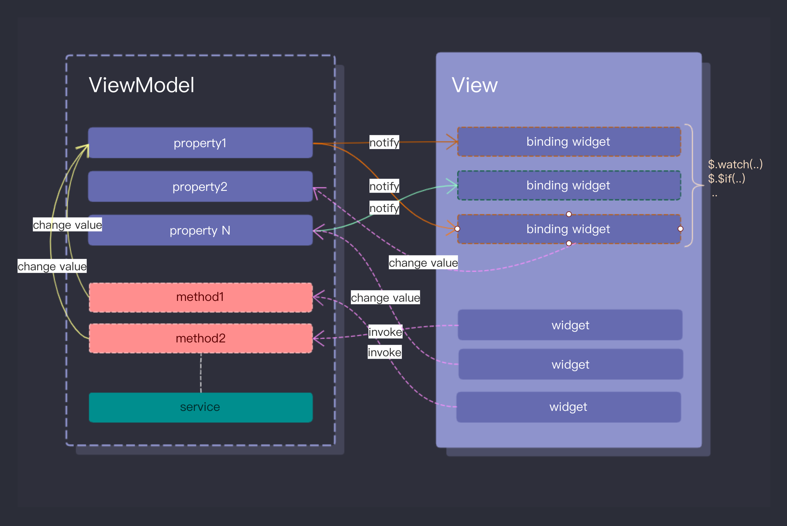

[](https://pub.dev/packages/mvvm)  [](https://gitter.im/flutter-mvvm/community?utm_source=badge&utm_medium=badge&utm_campaign=pr-badge&utm_content=badge)
  

A Flutter MVVM (Model-View-ViewModel) implementation. It uses property-based data binding to establish a connection between the ViewModel and the View, and drives the View changes through the ViewModel.
  
  

一个 Flutter 的 MVVM(Model-View-ViewModel) 实现。 它使用基于属性 (property) 的数据绑定在视图模型 (ViewModel) 与视图 (View) 之间建立关联，并通过视图模型 (ViewModel) 驱动视图 (View) 变化。 
  
##   

[Documentation](https://pub.dev/documentation/mvvm/latest/mvvm/mvvm-library.html)  & [Example](./example/lib/main.dart) 


 
```dart
import 'package:flutter/widgets.dart';
import 'package:mvvm/mvvm.dart';
import 'dart:async';

// ViewModel
class Demo1ViewModel extends ViewModel {

    Demo1ViewModel() {
        propertyValue<String>(#time, initial: "");
        start();
    }

    start() {
        Timer.periodic(const Duration(seconds: 1), (_) {
            var now = DateTime.now();
            setValue<String>(#time, "${now.hour}:${now.minute}:${now.second}");
        });
    }
}

// View
class Demo1View extends View<Demo1ViewModel> {
  Demo1View() : super(Demo1ViewModel());

  @override
  Widget build(BuildContext context) {
    return Container(
        margin: EdgeInsets.symmetric(vertical: 100),
        padding: EdgeInsets.all(40),
        // binding
        child: $.watchFor<String>(#time, 
            builder: $.builder1((t) => 
              Text(t, textDirection: TextDirection.ltr))));
  }
}

// run
void main() => runApp(Demo1View());

```





## APIs

### ViewContext ($.*)

#### Methods

* [watch](./APIs.md#watch)
* [watchFor](./APIs.md#watchfor)
* [watchAny](./APIs.md#watchany)
* [watchAnyFor](./APIs.md#watchanyfor)
* [$cond](./APIs.md#$cond)
* [$condFor](./APIs.md#$condfor)
* [$if](./APIs.md#$if)
* [$ifFor](./APIs.md#$iffor)
* [$switch](./APIs.md#$switch)
* [$switchFor](./APIs.md#$switchfor)
* [adapt](./APIs.md#$adapt)
* [builder0](./APIs.md#builder0)
* [builder1](./APIs.md#builder1)
* [builder2](./APIs.md#builder2)

### ViewModel

#### Methods

* [registryProperty](./APIs.md#registryproperty)
* [propertyValue](./APIs.md#propertyvalue)
* [propertyAdaptive](./APIs.md#propertyadaptive)
* [propertyAsync](./APIs.md#propertyasync)
* [getValue](./APIs.md#getvalue)
* [setValue](./APIs.md#setvalue)
* [updateValue](./APIs.md#updatevalue)


[Documentation](https://pub.dev/documentation/mvvm/latest/mvvm/mvvm-library.html)


## License

[MIT](LICENSE)